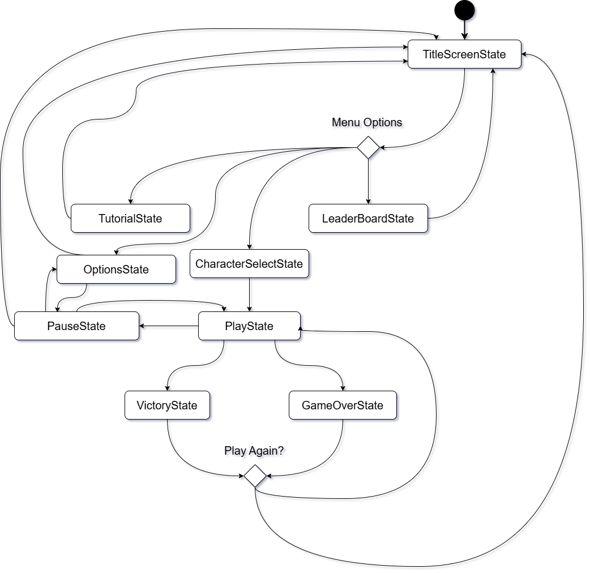
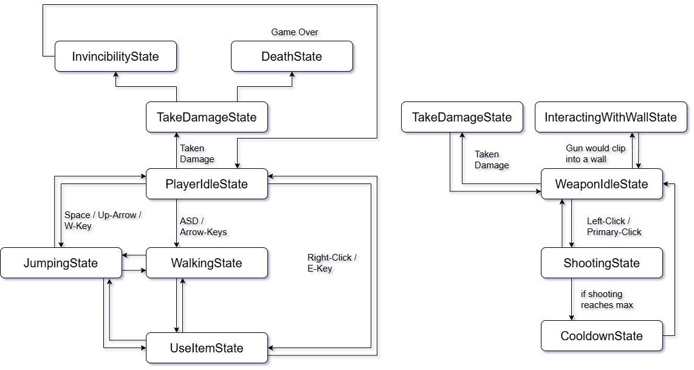
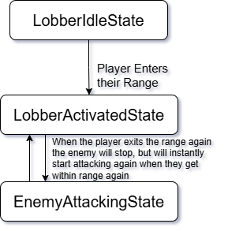
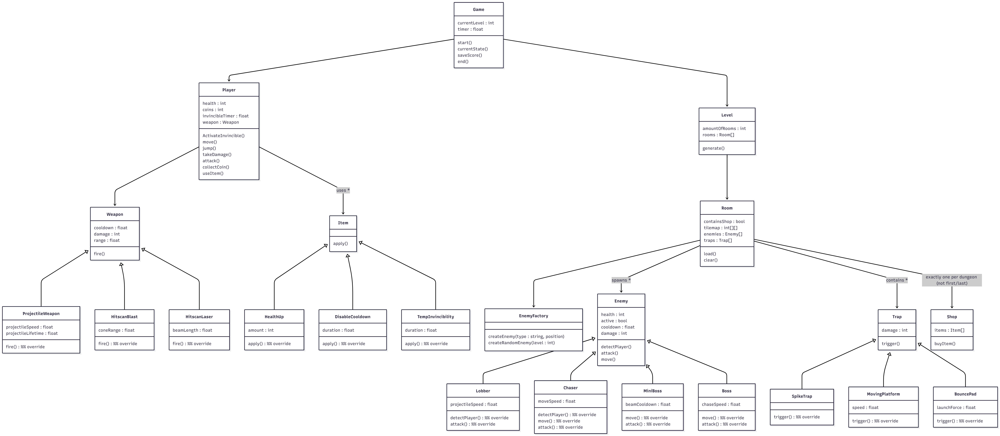
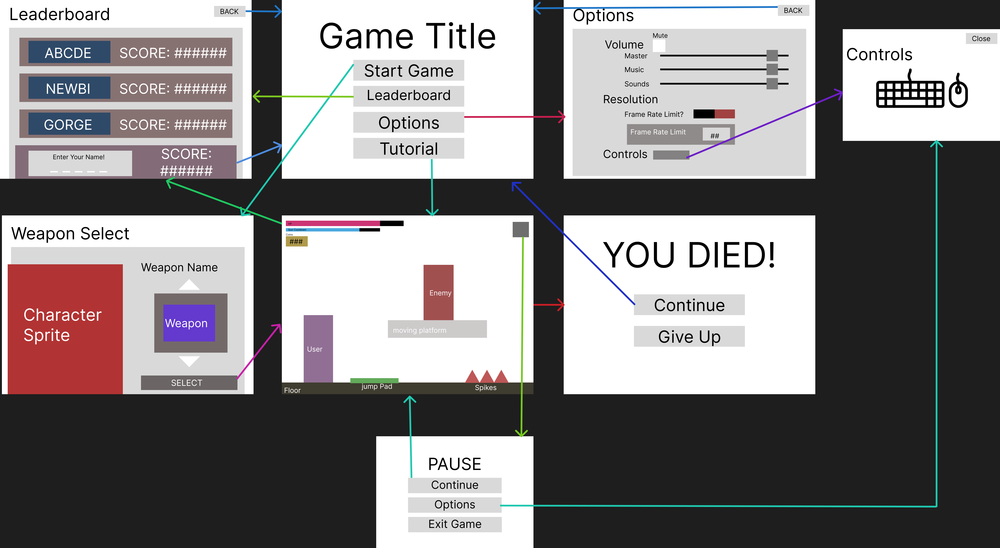

# Final Project

-   [x] Read the [project requirements](https://vikramsinghmtl.github.io/420-5P6-Game-Programming/project/requirements).
-   [ ] Replace the sample proposal below with the one for your game idea.
-   [ ] Get the proposal greenlit by Vik.
-   [ ] Place any assets in `assets/` and remember to update `src/config.json`.
-   [ ] Decide on a height and width inside `src/globals.js`. The height and width will most likely be determined based on the size of the assets you find.
-   [ ] Start building the individual components of your game, constantly referring to the proposal you wrote to keep yourself on track.
-   [ ] Good luck, you got this!

---

# **Greynought** - Luca Bousette

## ✒️ Description

In this platformer, users will go dungeon by dungeon blowing up enemies and completing the levels as fast as they can! If they complete every single dungeon they can add their score to the leaderboard, where all their scores are added together.

## 🕹️ Gameplay
>I  really want to focus on the customization and combat of *Terraria* with the movement and level design of *Super Metroid*, so the main focuses are on the weapon choices and obstacles

Before the player begins by choosing a **weapon**, this weapon is attached to the arm of the player that functions (besides the movement) independantly from the rest of the player. A weapon is used by aiming with your mouse / touchpad and then clicking the left-click / primary-click to fire. The three choices are:  

1. **Projectile:** Shoots a new physical object that damages an enemy if it interacts with it, Projectile bounces off walls and dissapears after it hits an enemy or after a small amount of time. Medium range, medium cooldown, medium damage.
2. **Hitscan Blast:** Checks a certain range infront of user, if an enemy is in that range it damages them. Short Range, short cooldown, High Damage.
3. **Hitscan Laser:** Shoots a straight blast infront of it that damages anything it interacts with. High range, High cooldown, low damage.

After the player begins **movemement** is standard WASD / Movement Keys (plus spacebar for jumping), also if shift is being held it'll speed the player's movements up. Players need to becareful of their **healthbar**, as many things can bring it down, however after being hit players gain a small quick invincibility cooldown before they can take damage again. While adventuring through rooms and levels players need to be pay attention to two things to keep that health bar from going to zero: **Traps** and **Enemies**. there are three types of traps:

1. **Spikes:** Damages player but doesn't instantly kill them
2. **Moving Platforms:** simple platforms that move back and forth
3. **Bounce Pads:** Increases the players vertical velocity tremendously

Enemies are more hazardous as they are gunning for your character, once a user enters their range they will beggining attacking you. The two types of enemies are:

1. **Lobber:** Stationary enemy that's AI simply throws small projectiles at user with a medium lengthed cooldown with a long range
2. **Chaser:** Chases The user, if they hit a wall they will hop over it. Their AI is not intelligent, just moving in whatever direction the user is, if a user gets in their short range does a strong attack. Short cooldown and a short range

>the chaser enemy is nice-to-have, not mandatory for the game to count as "complete"

To help against these enemies, randomly a room will turn out to be a shop where you can trade your coins for an item. The three **items** to aid the user through the dungeons:

1. **Health Up:** Increases the players health
2. **Disable Cooldown:** Turns Off The Cooldown for weapons for a couple seconds
3. **Temporary Invincibility:** Activates the player invincibility for a longer period of time

>the Items are a nice-to-have, not mandatory for the game to count as "complete"

Finally if users make it far enough they'll start to see **Mini Bosses** and eventually, **the final Boss**. the mini boss is a larger enemy that has two abilities, to shoot a large beam straight and throw ballistic balls into the air that hit the floor. The Final Boss chases the player though a room, if the player touches the final boss they die instantly. Besides that the player needs to avoid the final bosses fireballs and rocks falling from the sky.

>the bosses are nice-to-have, not mandatory for the game to count as "complete"

This implementation is a combination of Super Metroid's movement and levels with more Terraria style combat and randomness.

## 📃 Requirements

> I only included the things that I have stated to be mandatory for the game to count as complete, anything that is not here should but I have mentioned is a "Nice-To-Have".

1. The user will open the leaderboard (to see what their fighting for!)
2. The user will start the game
3. The user will select one of three weapons
4. A level will be generated that a user will load into (the amount of rooms increase as you go along, increasing the difficulty)
5. A Timer will be started after the game is begun, next to an indicator to the amount of coins a user has collected
6. The user will move around the room
7. The enemies will attempt to attack the user, taking away from user's health
8. Using the mouse to aim the user will shoot at the enemies
9. Upon killing an enemy coins will drop that can be picked up by user
11. User can go to the next room through a door
12. Randomly, a room a user goes through might be a shop they can exchange coins for an item
13. Once a user goes through the last door of the level the score is calculated and saved, with the User's health being full again
14. Every third level the user's final room will be a mini boss fight
15. On the tenth level it will just be the boss fight
16. Once user completes level 10 all their scores will be added up
17. Users score and chosen name will be displayed on the leaderboard
18. User has the option to play again or exit

## 🖼️ Diagrams

### 🤖 State Diagram

>Game States

>Player States

>Enemy States
 
>

### 🗺️ Class Diagram

### 🧵 Wireframes

-   On title screen, clicking **START GAME** leads to the Selection screen, and on confirmation leads to the game
- On title screen, clicking **LEADERBOARD** leads to the leaderboard screen, but you can only add your score after "winning" the game
- On title screen, clicking **OPTIONS**, it leads to the options screen
- On title screen, clicking **TUTORIAL** leads straight to the game screen with a preset map
- on options screen, clicking the **CONTROLS** button leads to a popup that shows what the controls are (Also simple instructions on how to play the game if I run out of time for the tutorial mini-level)
- on options screen, clicking the **BACK** button leads back to whatever screen you were on
- on Controls popup, clicking the **CLOSE** button or leaving the options screen brings you back to the title screen
- on leaderboard screen, clicking the **BACK** button or entering your name for a highsore will return you to the game screen
- on the Game screen, **Winning** will lead to the leaderboard screen
- on the Game screen, **Dying** will lead to the game over screen
- on the Selection screen, **Select** will lead to the actual game starting
- on the Game screen, pressing the **PAUSE** button will lead to the Pause screen
- on the Pause screen, pressing the **CONTINUE** button will lead back to the game
- on the Pause screen, pressing the **Options** button will lead to the Options Screen
- on the Pause screen, pressing the **EXIT GAME** button will cloes the game
- on the Game Over screen, pressing the **CONTINUE** button will lead to the game title screen
- on the Game Over screen, pressing the **GIVE UP** button will close the game

### 🧃 Juice

Taking off Terraria, I will be adding the dynamic lighting to the levels as well as particle effects with the weapons attacks.

- [Godot documentation for 2D dynamic lighting effects](https://docs.godotengine.org/en/stable/tutorials/2d/2d_lights_and_shadows.html)
- [Godot documentation for particle effects](https://docs.godotengine.org/en/latest/tutorials/2d/particle_systems_2d.html)

### 📲 Persistance

The current state of your game will be saved so that whenever you close and reopen it you will continue where you left off. Also the leaderboard will be saved

### 🎨 Assets

My current plan is to make them myself, will my skills in pixel art  need improvement overall I am proficient enough to make them (as I've done with a couple of games before). However my back-up plan incase I don't forsee me having enough time to implement everything is to use some sprites from older games with similar mechanics and from free online resources or to reuse game sprites from an old but similar game.

- [Super Metroid Remake Sprites](https://www.spriters-resource.com/snes/smetroid/)
- [Example of a free-to-use tileset from itch.io](https://free-game-assets.itch.io/free-industrial-zone-tileset-pixel-art)
- [Alien Girl Time Loop - A game that I made for the GMTK 2025 Game Jam](https://baguettenier.itch.io/alien-girl-time-loop)

#### ✏️ Fonts

While I haven't decided on the specific font yet it I will use this resource to pick the font I will use

- [Google Fonts - website for getting custom fonts](https://fonts.google.com/)

#### 🔊 Sounds

I am planning on using music from creators that have given me permission / allow their music to be used for free. Also all the sound effects will be free-to-use as well

- [AdhesiveWombat - allows use if project is not commercial](https://soundcloud.com/adhesivewombat)
- [Oliver Kachani - personal friend of mine whos allowed me to use their music for this project](https://open.spotify.com/artist/60N4KqNnfG1Z0pI6YethWG?si=qKLn0PtDSuKUScym0wl-cw)
- [Sonniss - this is royalty-free sound effects, their are many platforms like this that I could also get the sounds off of](https://sonniss.com/gameaudiogdc/)
